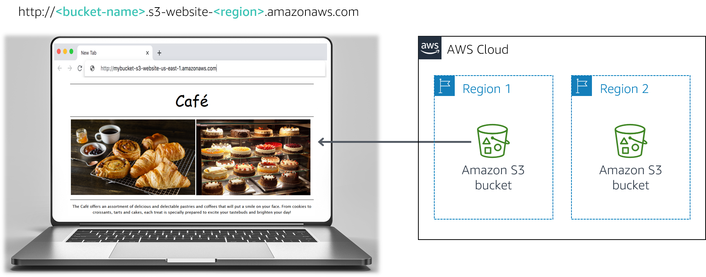

## Module 3 Challenge Lab: Creating a Static Website for the Café

## Lab overview and objectives

In this lab, you use Amazon Simple Storage Service (Amazon S3) to build a static website and implement architectural best practices to protect and manage your data.

After completing this lab, you should be able to:

- Host a static website by using Amazon S3
- Implement one way to protect your data with Amazon S3
- Implement a data lifecycle strategy in Amazon S3
- Implement a disaster recovery (DR) strategy in Amazon S3

At the end of this lab, your architecture should look like the following example:



## A business request for the café: Launching a static website (Challenge #1)

Sofía mentions to Nikhil that she would like the café to have a website that will visually showcase the café's offerings. It would also provide customers with business details, such as the location of the store, business hours, and telephone number.

Nikhil is happy that he was asked to create the first website for the café.

For this first challenge, you will take on the role of Nikhil and use Amazon S3 to create a basic website for the café.

## Task 1: Extracting the files that you need for this lab

1. Extract the files in the static-website folder.

## Task 2: Creating an S3 bucket to host your static website

1. In this task, you will create an S3 bucket and configure it to host your static website.

2. Open the Amazon S3 console.

    - Create a bucket to host your static website.

    - Create the bucket in the N. Virginia (us-east-1) AWS Region.
    - Tip: You must disable Block all public access.
3. Enable static website hosting on your bucket.

    - Tip: You will use the index.html file for your index document.


## Task 3: Uploading content to your S3 bucket

1. Upload the index.html file and the css and images folders to your S3 bucket.
2. In a separate web browser tab, open the endpoint link for your static website.

## Task 4: Creating a bucket policy to grant public read access

Frank shares his plan to create many new types of pastries for the café. You realize that you will need to upload an image for each new dessert that he creates, and enable public access on that object. You don't want to do this process manually. Instead, you decide to create a bucket policy that automatically makes each object public when it's uploaded to the folder.

1. Create a bucket policy that grants read-only permission to public anonymous users by using the Bucket Policy editor.

    Hint: If you get stuck, refer to the examples in the  [AWS Documentation](https://docs.aws.amazon.com/AmazonS3/latest/userguide/example-bucket-policies.html).

2. Confirm that the website for the café is now publicly accessible.

Congratulations! You now have a static website for the café.

## New business requirement: Protecting website data (Challenge #2)

You show Sofía the new website, and she's very impressed. Good job!

You and Sofía discuss that you will likely need to make many updates to the website as the number of café offerings expands.

Olivia, an AWS Solutions Architect and café regular, advises you to implement a strategy to prevent the accidental overwrite and deletion of website objects.

You already need to make some changes to the website, so you decide that this would be a good time to explore object versioning.

## You already need to make some changes to the website, so you decide that this would be a good time to explore object versioning.

In this task, you will enable versioning on your S3 bucket and confirm that it works.

1. In the S3 console, enable versioning on your S3 bucket.

    Note: Notice that after you enable versioning, you can't disable it.

2. In your favorite text editor, open the index.html file. For example, you could use Notepad++ or TextWrangler.

3. Modify the file according to the following instructions:

    - Locate the first line that has the embedded CSS code bgcolor="aquamarine" in the HTML, and change it to bgcolor="gainsboro".
    - Locate the line that has the embedded CSS code bgcolor="orange" in the HTML, and change it to bgcolor="cornsilk".
    - Locate the second line that has the embedded CSS code bgcolor="aquamarine" in the HTML, and change it to bgcolor="gainsboro".
    - Save the changes.

4. Upload the updated file to your S3 bucket.

5. Reload the web browser tab with your website and notice the changes.

6. To see the latest version of the index.html file, go to your bucket and choose List versions. You should see both versions of this file in the dropdown menu.


### Architecture best practice

In this task, you used one technique to implement the architecture best practice of protecting your data.

According to the [Well-Architected Framework](https://d1.awsstatic.com/whitepapers/architecture/AWS_Well-Architected_Framework.pdf), versioning can be part of a larger data lifecycle management process. Before you architect any system, foundational practices that influence security should be in place. For example, data classification provides a way to categorize organizational data based on levels of sensitivity. Encryption protects data by rendering it unintelligible to unauthorized access. These tools and techniques are important because they support objectives such as preventing financial loss or complying with regulatory obligations.

## New business requirement: Optimizing costs of S3 object storage (Challenge #3)

Now that you enabled versioning, you realize that the size of the S3 bucket will continue to grow as you upload new objects and versions. To save costs, you decide to implement a strategy to retire some of those older versions.

## Task 6: Setting lifecycle policies

In this task, you will set a lifecycle policy to automatically move older versions of the objects in your source bucket to S3 Standard-Infrequent Access (S3 Standard-IA). The policy should also eventually expire the objects.

1. Configure two rules in the website bucket's lifecycle configuration. To receive full credit, create two separate rules. Do not configure two transitions in a single rule:

    - In one rule, move previous versions of all source bucket objects to S3 Standard-IA after 30 days
    - In the other rule, delete previous versions of the objects after 365 days
    - Hint: If you get stuck, refer to the AWS Documentation for guidance.
    - Note: To limit the scope of the replication to a particular bucket object (for example, the index.html file), create a tag for the object before you create the lifecycle rule.

Good! You should now have a lifecycle configuration that will move previous versions of your source bucket objects to S3 Standard-IA after 30 days. The policy will also permanently delete the objects that are in S3 Standard-IA after 365 days.

### Architecture best practice

In this task, you implemented the architecture best practice of defining data lifecycle management.

According to the [Well-Architected Framework](https://d1.awsstatic.com/whitepapers/architecture/AWS_Well-Architected_Framework.pdf), in practice, your lifecycle strategy should be based on the criticality and sensitivity of your data, and legal and organizational requirements. You should consider factors such as data retention duration, data destruction, data access management, data transformation, and data sharing.

## Task 7: Enabling cross-Region replication

In this task, you will enable cross-Region replication on your source S3 bucket.

1. In a different Region than your source bucket, create a second bucket and enable versioning on it. The second bucket is your destination bucket.

2. On your source S3 bucket, enable cross-Region replication. When you create the replication rule, make sure that you:

    - Replicate the entire source bucket.
    - Use the CafeRole for the AWS Identity and Access Management (IAM) role. This IAM role gives Amazon S3 the permissions to read objects from the source bucket and replicate them to the destination bucket.
    - If you encounter the warning The replication rule is saved, but it might not work, you can ignore it and proceed to the next step.
    - Hint: If you get stuck, refer to the [AWS Documentation](https://docs.aws.amazon.com/AmazonS3/latest/userguide/replication-example-walkthroughs.html#enable-replication-add-rule) for guidance.
Note: CafeRole has the following permissions:


```
Version: 2012-10-17
Statement:
  - Action:
  - s3:ListBucket
  - s3:ReplicateObject
  - s3:ReplicateDelete
  - s3:ReplicateTags
  - s3:Get*
    Resource:
  - '*'
    Effect: Allow
```

This access policy allows the role to perform the replication tasks on all S3 buckets. In a real production environment, you should restrict the policy to apply only to your source and destination S3 buckets. For more information about creating an IAM role, refer to [Setting Up Permissions for Replication](https://docs.aws.amazon.com/AmazonS3/latest/userguide/setting-repl-config-perm-overview.html).

3. Make a minor change to the index.html file and upload the new version to your source bucket.

4. Verify that the source bucket now has three versions of the index.html file.

5. Confirm that the new object was replicated to your destination bucket. You might need to reload the browser tab.

6. Go to your source bucket and delete the latest version.

### Architecture best practice

In this task, you implemented the architecture best practice of automating disaster recovery.

According to the [Well-Architected Framework](https://d1.awsstatic.com/whitepapers/architecture/AWS_Well-Architected_Framework.pdf), the start of your DR strategy is having backups and redundant workload components in place. You should use AWS or third-party tools to automate system recovery and route traffic to the DR site or Region.