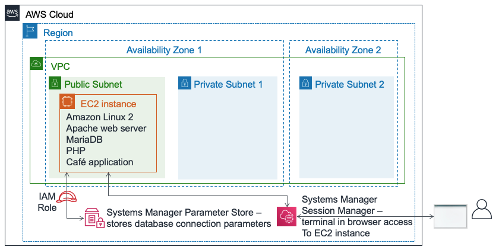
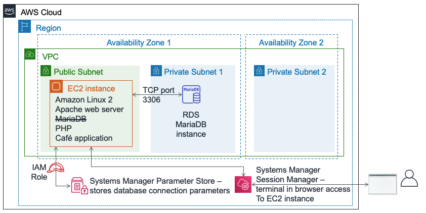

# Module 5 – Challenge Lab: Migrating a Database to Amazon RDS

## Scenario

The café currently uses a single EC2 instance to host their web server, database, and application code.

Meanwhile, café business has grown. The order history that's stored in the database provides valuable business information that the café staff doesn't want to lose. Martha uses the data for accounting, and Frank looks at it occasionally to plan how many of each dessert type he should bake.

Sofía has additional concerns. The database must be consistently upgraded and patched, and she doesn’t always have time to do these tasks. Also, administering the database is a specialized skill. Training others to do database administration isn’t something that she wants to spend time on. Meanwhile, Sofía is also concerned that the café isn’t doing data backups as often as they should.

Finally, Martha also wants to reduce labor costs that are associated with the technical learning investment that's needed to manage the database.

## Lab overview and objectives

In this lab, you will migrate data from a database on an Amazon Elastic Compute Cloud (Amazon EC2) instance to Amazon Relational Database Service (Amazon RDS). Specifically, you will migrate a MariaDB database that runs on an EC2 instance to a MariaDB database that runs on Amazon RDS. You will also update the café web application to use the new database to store data for all future orders.

After completing this lab, you should be able to:

- Create an RDS database instance
- Export data from MariaDB database by using mysqldump
- Connect a SQL client to an RDS database.
- Migrate data from a MariaDB database that runs on an EC2 instance to an RDS database instance
- Configure a web application to use the new RDS database instance for data storage


When you start the lab, the following resources are already created for you in the AWS account:



At the end of this lab, your architecture will look like the following example:



## A business request: Creating an RDS instance for the café application (Challenge #1)

A business request: Creating an RDS instance for the café application (Challenge #1)

In the first part of this lab, you will take on the role of Sofía. You will create an RDS instance that the café can use as the data storage layer for the café website. You will also connect to the EC2 instance and analyze the details of the cafe web application.

## Task 1: Creating an RDS instance

Your first challenge in this lab is to create an RDS instance.

1. Create an RDS instance that complies with these specifications. (When you submit your work at the end of this lab, it will check for many of these settings. To get full credit, follow these guidelines.)

        Engine type: `MariaDB`

        Templates: `Dev/Test`

        DB instance identifier: CafeDatabase

        Username: admin

        Password: Caf3DbPassw0rd!

        DB Instance Class: db.t2.micro

        Storage type: General Purpose (SSD)

        Allocated storage: 20 GiB

        Do not create a standby instance

        Place it in the Lab VPC

        Subnet Group: lab-db-subnet-group, where the database is not publicly accessible.

        Choose existing VPC security group named dbSG, and unselect the default security group.

        Availability Zone: Choose the first Availability Zone in the list, which ends in a. For example, if the Region is us-east-1, choose us-east-1a.

        Database port: Keep the default TCP port of 3306.

        Enhanced monitoring is not supported in the lab environment. Clear the default setting.

`Important`: Don't wait for the database to finish the creation process. Instead, after you have successfully started the database creation process, continue to the next step.

## Task 2: Analyzing the existing café application deployment

In this task, you will connect to the existing EC2 instance that runs the current café application.

2. Browse to the EC2 Console and choose Running instances. Notice the running instance named CafeServer. This EC2 instance was created when you started the lab.  
3. Test the café application.
    - Open a new browser tab and load the café application at `http://<public-ip-address>/cafe`. Note: Replace <public-ip-address> with the actual IPv4 public IP address of the CafeServer instance.
    - Browse to the Menu page and test placing an order. To do this, change the quantity for at least one menu item to at least 1 and choose Submit Order. An Order Confirmation page should display, which indicates that the café website is working as intended.
    - Choose Order History. The page shows that many orders were placed. The current database contains past customer orders that you will migrate to a database that's hosted on Amazon RDS.
4. Connect to the EC2 instance by using AWS Systems Manager to access a terminal session in the browser.
    - Back in the AWS Management Console, navigate to the Systems Manager Console and choose Session Manager.
    - Start a session and connect to the CafeServer. You should now have a new browser tab open, with a terminal session that's connected to the EC2 instance.
    - At the prompt, enter the following commands:
    ```
    bash
    sudo su
    su ec2-user
    whoami
    cd /home/ec2-user/
    ```
    `Analysis`: The first command gave you a Bash shell. The second command switched your session to use the root user account on the EC2 instance. The third command switched you to use the ec2-user account. The fourth command should have returned output that confirms that you are connected as the ec2-user. The last command switches your terminal to the home directory of the ec2-user.


    `Note`: The Systems Manager agent (ssm agent) is installed by default on all Amazon Linux 2 instances (and some other OS types). When you started the lab and the EC2 instance was created, the user data specified that the ssm agent service should be started on the instance. Also, an AWS Identity and Access Management (IAM) role that includes an IAM policy named AmazonSSMManagedInstanceCore was attached to the EC2 instance. These two actions made the instance accessible through the Systems Manager session manager.

## New business requirement: Exporting data from the old database and establishing a connection to the new database (Challenge #2)

Now that you created a new RDS instance, you can move on to the next step in the café's database migration plan. Next, you will export the data from the database that the café application currently uses. You will also establish a network connection from the EC2 instance (where the application runs) to the new RDS database instance.

In this challenge, you continue as Sofía to complete these tasks.

## Task 3: Working with the database on the EC2 instance

In this task, you will observe details about the MariaDB database that runs on the EC2 instance. You will then export existing order history data from the database by using the mysqldump utility.

5. Observe details of the database that runs on the EC2 instance. In the terminal, run these commands:
    ```
    service mariadb status
    mysql --version
    ```
    The output should show that the locally installed MariaDB database on this EC2 instance is running. It should also show the version number of the database. Leave this browser tab open. You will use it throughout this lab.

6. Return to the browser tab with the AWS Systems Manager console open in it.

7. From the panel on the left, under Application Management, choose Parameter Store. Notice that seven parameters are stored here. The café application PHP code references these values—for example, to retrieve the connection information for the database.
    - Choose the `/cafe/dbPassword` parameter, and copy the `Value` to your clipboard. You will use this value in a moment.

8. Connect to the database that is running on the EC2 instance. In the browser tab with the Bash terminal, connect the terminal-based MySQL client to the database by running this command:
    ```
    mysql -u root -p
    ```

    When prompted for the database password, paste the dbPassword parameter value that you copied a moment ago. You should now see a  `mariadb>` prompt. This prompt indicates that you are now connected to the MariaDB database that runs on this EC2 instance.

9. Observe the data in the existing database. To observe the contents of the database, enter the following commands. In particular, you will review the tables that support the café web application.
    ```
    show databases;
    use cafe_db;
    show tables;
    select * from `order`;
    ```
    These commands show all the orders that were placed, including the order that you placed a moment ago.
    ```
    select * from `order_item`;
    ```
    This command shows the order line items. Each order number has a row for each type of item that was ordered, with details about the quantity of each item and the price. All this data must be migrated to the new database.

10. Exit the SQL client.
    ```
    exit
    ```

11. Capture existing data in a file by using the mysqldump utility.
    ```
    mysqldump --databases cafe_db -u root -p > CafeDbDump.sql
    ```
    When prompted for the database password, paste the dbPassword value from the Systems Manager Parameter Store.

12. Confirm that mysqldump succeeded.
    - Run the `ls` command in the terminal. The output should show that the `CafeDbDump.sql` file was created.
    - Run the cat `CafeDbDump.sql` command to see the contents of the file. 

    In the next section of the lab, you will import this data to the new RDS database.


## Task 4: Working with the RDS database

13. Establish a network connection from the terminal running on the EC2 instance to the new RDS instance.

### Tips to help you get started:
`Tip 1:` Here is the syntax that you can use to connect:
 ```
 mysql -u admin -p --host <rds-endpoint>
 ```
Replace `<rds-endpoint>` with the actual RDS endpoint for your RDS instance.
After you run the command, it will prompt you to enter the password for the RDS instance. You defined this password when you created the RDS instance.

`Tip 2:` Even if you enter the RDS endpoint and database password correctly, you still won't be able to connect. You must update the inbound rules of the security group that the RDS instance runs in. The MySQL client software tries to connect to the database on TCP port 3306.

`Tip 3:` Avoid opening port 3306 to all source IP addresses. That would not be secure. Instead, open it only to servers in the security group that is used by the EC2 instance that you're connecting from (try typing `sg-` into the source field to see options).

`Tip 4:` You can confirm that the security group settings allow traffic on TCP port 3306 from the EC2 instance to the database. Try running these commands in the Systems Manager session manager terminal (replace with the actual RDS endpoint):
```
nmap -Pn <rds-endpoint>
```
If the output of the command shows that port 3306 is open for the *mysql* service, then it confirms that the security group settings allow the traffic.
If nmap shows that the port is open, then the 
```
mysql -u admin -p --host <rds-endpoint>
``` 
command should also work. (However, you must enter the database password correctly. This password is the one that you set when you created the instance).

`Note:` It's important to confirm that you can connect to the RDS MariaDB before you go to the next step.

13. Run the `show databases`; command. It should show this output:
    - Notice that `cafe_db` database is not in the list yet. This situation is expected, because you haven't imported any data.  
    - To disconnect, run the `exit`; command.


## New business requirement: Importing data and connecting the application to the new database (Challenge #3)

In the previous challenge, you exported the data from the database that the café application currently uses. you also established a network connection from the EC2 instance to the RDS instance. You can now work on the next business requirement.

In this challenge, you will continue to take on the role of Sofía to import the cafe data into the RDS database instance. After you complete the import, you will configure the application to use the new database.

## Task 5: Importing the data into the RDS database instance

14. Import the data that you exported in task 3 to the RDS database instance.
    - To import the data, in the terminal, run the following command (where `<rds-endpoint>` is the actual endpoint):
    ```
    mysql -u admin -p --host <rds-endpoint> < CafeDbDump.sql
    ```
    - At the password prompt, enter the password for the RDS instance. If you don't see any errors, the command likely succeeded.

15. Confirm that the data was imported.
    - To connect to the RDS database, run this command:
    ```
    mysql -u admin -p --host <rds-endpoint>
    ```
    - At the password prompt, enter the password for the RDS instance.

    - To confirm that the data was imported, run the following command:

    ```
    show databases;
    use cafe_db;
    show tables;
    select * from `order`;
    ```

    The output of the select statement should show at least 24 orders in the database.

    - Exit the SQL client:
    ```
    exit;
    ```

## Task 6: Connecting the café application to the new database

In this last task in the lab, you will be challenged to connect the café application to the new database. You will also stop the database that runs locally on the EC2 instance.

16. Return to the AWS Systems Manager console browser tab.

17. From the panel on the left, choose `Parameter Store`. Recall from an earlier challenge lab that the café application's PHP code references these values. For example, it uses the values to retrieve the connection information for the database.

18. Connect the café application to the RDS instance. Because the database connection information has changed, you must update these values to connect the application to the new RDS database instance instead of to the database running on the EC2 instance.


`Tip 1:` 
After you update which database the application is connected to, use the `http://<public-ip>/cafe/menu.php` page to test whether you have successfully updated the connection.


`Tip 2: `
The PHP code doesn't need any updates. Also, the network configuration doesn't need additional changes, assuming that you successfully completed the previous challenge in this lab. The only updates that you must make will be to some values in the Systems Manager Parameter Store.


`Tip 3:` 
The currency, dbName, timeZone, and showServerInfo values don't need to be updated.


`Tip 4: `
The dbUrl should be the RDS endpoint value.


19. Confirm that your web application now uses the new database. 
    - Stop the database that's still running on the EC2 instance. In the terminal, use this command:
    ```
    sudo service mariadb stop
    ```

    - Load the `http://<public-ip>/cafe/menu.php` page and confirm that the application still works by placing an order.

    - Choose Order History. Your latest order—and all the other previous orders—should be there. These orders are the data that you migrated to the new database.


## Update from the café

Everyone at the café is happy with the results of the database migration. Sofía and Nikhil now have more free time on weekends, which means that Frank and Martha are saving money on labor costs.

Sofía takes a minute to relax with her friends. However, she's already thinking about improvements. A good next step would be to reduce the size of the EBS volume that the EC2 instance uses. They could also save on expenses by changing the EC2 instance type to a smaller size. Because the database no longer runs on the EC2 instance, the instance now has extra hard drive space—and it might also not need as many CPU and memory resources.