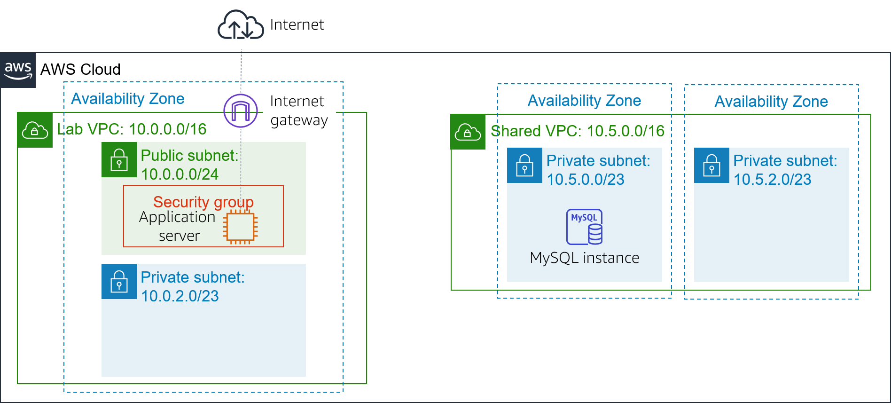
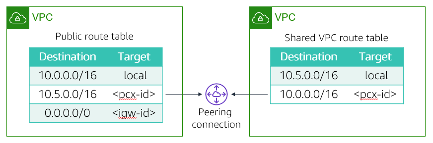

# Module 7 - Guided Lab: Creating a VPC Peering Connection

## Lab overview and objectives

You might want to connect your virtual private clouds (VPCs) when you must transfer data between them. This lab shows you how to create a private VPC peering connection between two VPCs.

After completing this lab, you should be able to:
- Create a VPC peering connection
- Configure route tables to use the VPC peering connection

At the end of this lab, your architecture will look like the following example:

## Task 1: Creating a VPC peering connection

Your task is to create a VPC peering connection between two VPCs.

A VPC peering connection is a one-to-one networking connection between two VPCs that enables you to route traffic between them privately. Instances in either VPC can communicate with each other like they are in the same network. You can create a VPC peering connection between your own VPCs, in a VPC in another AWS account, or with a VPC in a different AWS Region.

Two VPCs are provided as part of this lab: Lab VPC and Shared VPC. Lab VPC has an Inventory application that runs on an Amazon Elastic Compute Cloud (Amazon EC2) instance in a public subnet. Shared VPC has a database instance that runs in a private subnet.

1. In the AWS Management Console, on the `Services` menu, choose `VPC`.
2. In the left navigation pane, choose `Peering Connections`.
3. Choose `Create Peering Connection` and configure:
    - Peering connection name tag: `Lab-Peer`
    - VPC (Requester): `Lab VPC`
    - VPC (Accepter): `Shared VPC`
    - Choose `Create Peering Connection` then choose `OK`

    When a VPC peering connection is created, the target VPC must accept the connection request. The target VPC must accept the request because it might be owned by a different account. Alternatively, the user that creates the peering connection might not have permission to accept the connection request for the target VPC. However, in this lab, you will accept the connection yourself.

4. Select `Lab-Peer`.
5. Choose `Actions` then select `Accept Request`, and choose `Yes, Accept` to accept the request.
6. In the pop-up box, choose `Close`.

## Task 2: Configuring route tables

You will now update the route tables in both VPCs to send traffic from Lab VPC to the peering connection for Shared VPC.

7. In the left navigation pane, choose `Route Tables`.
8. Select  `Lab Public Route` Table (for Lab VPC). You will configure the Public Route Table associated with Lab VPC. If the destination IP address falls in the range of Shared VPC, the Public Route Table will send traffic to the peering connection.
9. In the `Routes` tab, choose `Edit routes` then configure these settings:
    - Choose `Add route`
    - Destination: `10.5.0.0/16` (The setting is the Classless Inter-Domain Route, or CIDR, block range of Shared VPC.)
    - Target: Select `Peering Connection`, and then from the list, select `Lab-Peer`.
    - Choose `Save routes` then choose `Close`.

You will now configure the reverse flow for traffic that comes from Shared VPC and goes to Lab VPC.

10. Select  `Shared-VPC Route Table`. If the check boxes for any other route tables are selected, clear them. This route table is for Shared VPC. You will now configure it to send traffic to the peering connection if the destination IP address falls in the range of Lab VPC.
11. In the `Routes` tab, choose `Edit routes` then configure these settings:
    - Choose `Add route`
    - Destination: `10.0.0.0/16` (This setting is the CIDR block range of Lab VPC.)
    - Target: `Select Peering Connection`, and then from the list, select `Lab-Peer`.
    - Choose `Save routes` then choose `Close`.

    The route tables are now configured to send traffic via the peering connection when the traffic is destined for the other VPC.

## Task 3: Testing the VPC peering connection

Now that you configured VPC peering, you will test the VPC peering connection. You will perform the test by configuring the Inventory application to access the database across the peering connection.

12. On the `Services` menu, choose `EC2`.
13. In the left navigation pane, choose `Instances`.
14. Copy the `IPv4 Public IP` address that is shown in the `Description` tab.
15. Open a new web browser tab with that IP address.

You should see the Inventory application and the following message: "Please configure settings to connect to database"

16. Choose `Settings` and configure:
    - Endpoint: Paste the database endpoint. To find this endpoint, select Details. Next to AWS, choose Show. Then, copy the Endpoint.
    - Database: `inventory`
    - Username: `admin`
    - Password: `lab-password`
    - Choose `Save`

The application should now show data from the database.

This step confirms that the VPC peering connection was established because Shared VPC does not have an internet gateway. The only way to access the database is through the VPC peering connection.