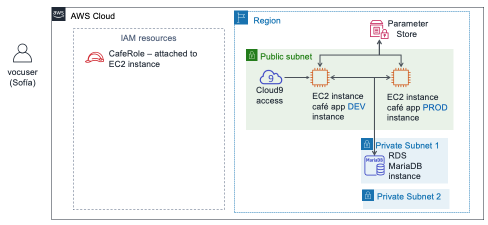
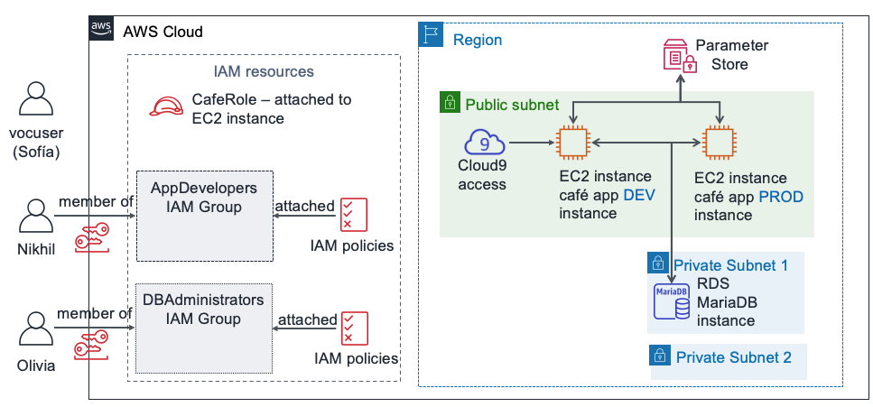
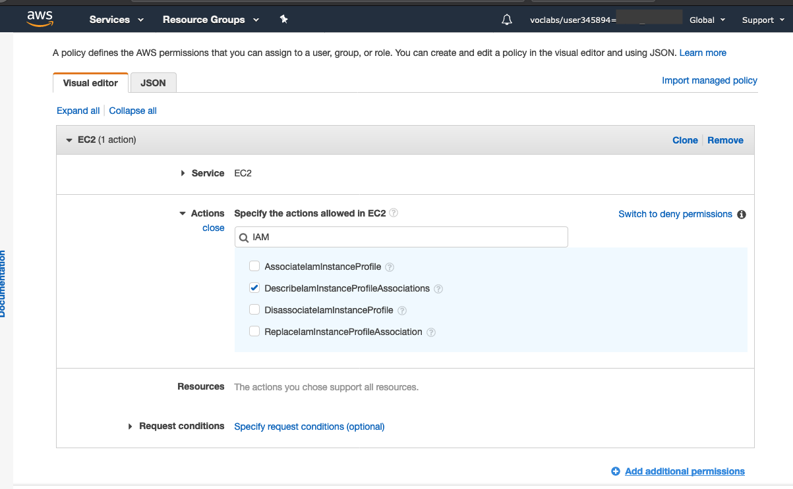
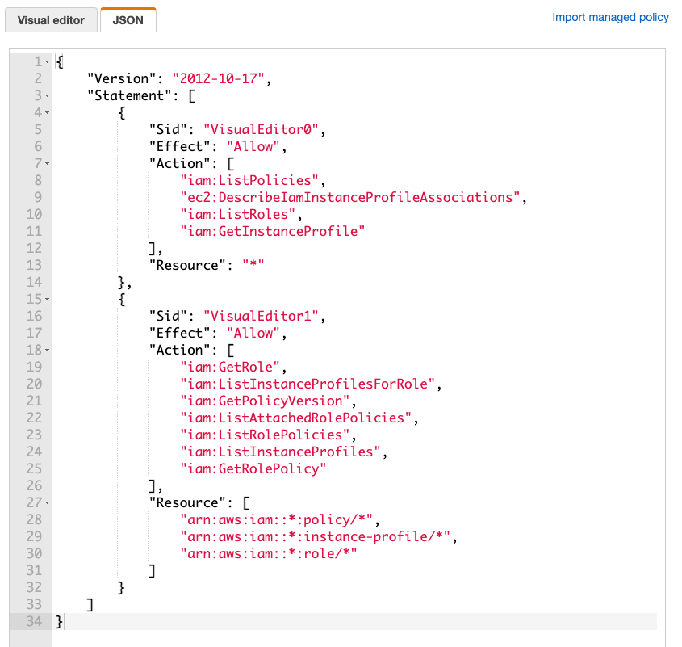

# Module 8 – Challenge Lab: Controlling AWS Account Access by Using IAM

## Scenario
After speaking with Mateo about the café's AWS infrastructure, Sofía realized that she must address some basic security concerns about the way that the café staff has been using the AWS account.

The café is now large enough that team members who build, maintain, or access applications on AWS are specializing into roles (such as developer or database administrator). Up to now, they haven’t made an effort to clearly define what level of access each user should have based on their roles and responsibilities.  

Sofía spent some time thinking about what each person should be able to do in the account, especially with AWS Cloud9, Amazon Elastic Compute Cloud (Amazon EC2) and Amazon Relational Database Service (Amazon RDS). She made some decisions and created this chart, which describes how she would like to define access rights in the AWS account:

| IAM Group     | IAM User | AWS Service Access | Reason |
| ----------- | ----------- | ----------------- | ---------- |
| App Developer | Nikhil | AWS Cloud9 access to Amazon EC2 development environment. Also, read-only access to Amazon EC2. | Nikhil often works as an application developer. He should be able to access the AWS Cloud9 environment for the development environment of the café web application. However, he shouldn't have access to the production environment. He should also be able to see all Amazon EC2 resources and configuration details, but he shouldn't be able to modify them. |
| DBAdministrators   | Olivia        | Full access to Amazon RDS. Also, full access to AWS Systems Manager. | Olivia was hired as a contract database administrator to help manage the database that the café web application uses. She should thus have full Amazon RDS access rights. She will also need access to AWS Systems Manager, where the database connection information is stored. However, beyond access to these two services, Sofía can't think of any reason why Olivia would need more access to AWS resources. |


Notice that instead of assigning permissions directly to users, Sofía decided to define IAM groups. Next, she will attach the IAM policies that grant access to those groups. Then, she plans to assign the users to the appropriate groups. If the café hires more developers or database administrators, she can add them as new users to the groups. The new users will inherit the correct permissions for their role in developing and maintaining the AWS account infrastructure. This approach will scale as the café expands.

Now that Sofía knows what access rights she wants to assign to which users, she's ready to get started!

## Lab overview and objectives

In this lab, you will use AWS Identity and Access Management (IAM) to define different access rights for different users. You will test access and adjust access. You will also observe how the access rights that you grant affect what actions the IAM users can perform on AWS account resources.

After completing this lab, you should be able to:
In this lab, you will use AWS Identity and Access Management (IAM) to define different access rights for different users. You will test access and adjust access. You will also observe how the access rights that you grant affect what actions the IAM users can perform on AWS account resources.

After completing this lab, you should be able to:

- Create IAM users and IAM groups, and associate IAM policies with IAM groups
- Indicate how limited access rights affect what resources IAM users can access and what actions they can take
- Use AWS managed IAM policies to modify user access rights and observe the results
- Use the IAM Policy Simulator to observe the scope of the access that is granted by different policies
- Access the IAM Access Advisor to observe what access rights different users are taking advantage of
- Create custom IAM policies by using the visual editor

When you start the lab, the following resources are already created for you in the AWS account:



At the end of this lab, your architecture will include the following resources and configurations:




## A business request: Configuring AWS account access for application developers (Challenge #1)

The cafe wants to configure access permissions that are appropriate for application developers. You will take on the role of Sofía to configure the access. You will then take on the role of Nikhil and test the access for application developers.

### Task 1: Configuring an IAM group with policies and an IAM user

In this first task in the lab, you will work as Sofía, the AWS account administrator.

As Sofía, you will create an IAM group and assign AWS managed policies to the group. You will then create a new IAM user, and add that user as a member of the group. Next, you will create an AWS Cloud9 environment on the existing EC2 instance where the development version of the café web application runs. Finally, you will share the development environment with the new user.

`Note`: The user you are logged in as displays in the upper-right area of the webpage. It should currently indicate that you are logged in as a voclabs user. In this lab, imagine that the voclabs user is Sofía.

1. In the console, open the IAM service page.

2. Create an `IAM group` named AppDevelopers, and attach the following IAM policies to it:

    - `AmazonEC2ReadOnlyAccess`
    - `AWSCloud9EnvironmentMember`

3. Create an IAM user and add the user to the AppDevelopers group.

    - User name: `Nikhil`

    - Access type: `AWS Management Console access`

    - Custom password: `@ppD3veloper2020!`

    - Require password reset: Clear this check box

    - Add Nikhil to the `AppDevelopers` group

    - Note: You don't need to add any tags

    - In the Success screen, you can optionally choose `Download .csv` and save the file to your computer

    - Choose `Close`

 
4. While still logged in as the voclabs user (Sofía), connect to the AWS Cloud9 IDE and set up the café web application.

    - Open the `AWS Cloud9` service page and under `DEVCafeServer`, choose `Open IDE`. The AWS Cloud9 IDE that run on an EC2 instance should now display.

    - In the Bash terminal window at the bottom of the screen, paste and run these three commands:

    ```
    wget https://aws-tc-largeobjects.s3-us-west-2.amazonaws.com/ILT-TF-200-ACACAD-20-EN/mod8-challenge/install-cafe-app.sh

    chmod +x install-cafe-app.sh
    ./install-cafe-app.sh
    ```

    `Note`: You do not need to wait for the script to finish running. Instead, go to the next step.


5. Share the AWS Cloud9 environment with the Nikhil user.

    - In the top-right corner of the AWS Cloud9 IDE, choose `Share`.
    - In the `Share this environment` panel, under `Invite Members`, enterNikhil and choose `Invite`.
    - Choose OK, choose OK again, and then choose Done.

    `Important`: Close the AWS Cloud9 IDE browser tab, but leave open at least one other browser tab where you are logged into the AWS Management Console as the voclabs user (Sofía).


### Task 2: Logging in as Nikhil and testing access

In this task, you will work as Nikhil to test the access permissions that Sofía configured.

`Tip`: We recommend opening an incognito or private browser tab to log in as Nikhil.  

- For example, if you are using Chrome, choose File > New Incognito Window. If you are using Firefox, choose File > New Private Window.
- Alternatively, use a different browser (for example, if you used Chrome to complete Task 1, use Firefox, Edge, or Safari for Task 2).

`Note`: Using an incognito session, a private session, or a different browser is convenient. You can remain logged in as both the voclabs user and as another user (such as Nikhil) simultaneously. You can thus switch between these two user-access levels without needing to log out or log in repeatedly. The authenticated session information in the different browser tabs will be isolated from one another.

6. As Nikhil, log in to the AWS Management Console.

    - In the browser tab where you are logged in as the voclabs user (Sofía), open the `IAM` console, choose `Users`, and then choose `Nikhil`.

    - Choose the `Security credentials` tab, and in the `Sign-in credentials` section, copy the `Console sign-in link`.

    - Paste the link into an incognito or private browser tab (or other browser as explained in the previous tip).

    - In the `Sign in as IAM user` screen, enter Nikhil's credentials and choose Sign in.

        - IAM user name: `Nikhil`

        - Password: `@ppD3veloper2020!`

 

7. Open the `Amazon EC2` console and in a browser tab, load the café web application.

    - Verify that you are in the correct `Region` (for example, N. Virginia) and switch to it, if necessary.

    - You should be able to view all the details of the EC2 instances.

    - Locate and copy the `IPv4 Public IP address` of the `aws-cloud9-DEVCafeServer` instance.

    - In a new browser tab, load `http://<dev-public-ip-address>/cafe`, where `<dev-public-ip-address>` is the IP address that you copied.

    The café website should display. Keep this browser tab open for later in the lab.

 

8. Test your Amazon EC2 access further by attempting to restart the web server.

    - Try to reboot the aws-cloud9-DEVCafeServer instance

    - Tip: To find the Reboot instance option, select the instance and look in the Instance state menu.


###  Accessing the Development server as Nikhil

9. Return to the browser tab where you are logged into the AWS Management Console as Nikhil.

    `Tip`: Remember that you can see which user you are using in the top-right area of the browser interface.

10. Browse to the `AWS Cloud9` console, and connect to the AWS Cloud9 IDE on the DEVCafeServer EC2 instance.

    - From the `Services` menu, choose `AWS Cloud9`.

    - On the left, expand the menu by choosing the    (menu icon), choose `Environments`. In the `Environments` drop-down it should say `My environments`. Select the drop-down and choose `Shared with me`. The `DEVCafeServer` environment is now listed.

    - Choose `Open`.

    `Note`: You have just connected to the guest OS of the aws-cloud9-DEVCafeServer EC2 instance. You observed this instance in the Amazon EC2 console a moment ago. You can use the IDE to browse and edit files on the web server. It also provides a Bash terminal that runs on the instance.

 

11. On the development instance of the café website, modify the main heading for the webpage.

    - Open the main webpage in the editor by going to the file browser, navigating to the `DEVCafeServer/www/html/cafe` directory, and double-clicking `index.php`.

    - Modify line 13 So that it reads:

    ```
    <div class="center">Caf&eacute; DEV Site</div>
    ```

    - To save the change, choose `File > Save` and in the browser, refresh the `http://dev-public-ip-address/cafe/` webpage.

    Notice that, while acting as Nikhil, you changed the main heading of the webpage in the development environment.

12. Test the connectivity of the web application database.    

    - In the café website, choose Menu.

    - What message displays?

13. As Nikhil, open the Systems Manager Parameter Store.

    - In the console, open the `Systems Manager` service.

    - From the menu on the left, choose `Application Management > Parameter Store`.

    - What message displays?

    Nikhil alerts Sofía about the issue on the development server that's preventing him from improving the café web application. Sofía is concerned. She asks Nikhil to check if the production version of the website is experiencing the same issue.

14. As Nikhil, verify that the production café web application is working correctly.

    - Open the `Amazon EC2` console and copy the `IPv4 Public IP address` of the `PRODCafeServer` instance.
    - In a new browser window, load `http://prod-public-ip-address/cafe/menu.php`.
    - Does the webpage display correctly, and can you place orders?


## New business requirement: Configuring AWS account access for database administrators (Challenge #2)

Nikhil reports the results of his test to Sofía. She's glad to know that the production site is still functioning well. However, Sofía wants to correct the problem on the development site.

Sofía decides that she will ask Olivia to fix the issue. However, Sofía must first define the AWS account access rights for database administrators. She must then create an IAM user resource so that Olivia can log in to the account.

### Task 3: Configuring IAM for database administrator user access

Task 3: Configuring IAM for database administrator user access

15. Back in the browser where you are logged in as the voclabs user (Sofía), create an `IAM group` named `DBAdministrators`, with the following permissions:
    - `AmazonRDSReadOnlyAccess`
    - `AmazonSSMFullAccess`

    `Note`: In a real-world situation, Sofia would need to grant more than simply read only access to RDS to her database administrators. However, the permissions in this lab environment, do not allow you to attach the AmazonRDSFullAccess policy. Instead, for this lab, you should use the AmazonRDSReadOnlyAccess policy as a substitute.

16. Create an IAM user that's named `Olivia` with access to the `AWS Management Console`.  
    - Set a custom password: `Db@dministrat0r2020!`
    - Clear the requirement to reset the password


17. Add Olivia to the `DBAdministrators` group.


### Task 4: Logging in as the database administrator and resolving the database connectivity issue

In this task, you will work as Olivia to resolve the database issue that Nikhil identified. You will also work as Sofía to help Olivia resolve some issues.

18. As Olivia, log in to the AWS Management Console.

    `Tip`: Use the incognito session, private session, or other browser type that you used to log in as Nikhil. To do this:

    - Choose `Nikhil @ <account-number>` in the top-right area of the console and choose `Sign Out`.

    - Then, choose `Log back in`.

    The Sign in as IAM user screen should display, with the Account ID pre-populated.

    `Note`: If the login screen doesn't display the account ID, return to the browser tab where you are still logged in as the voclabs (Sofía) user. In the IAM console, choose `Users` and choose `Olivia`. Choose the `Security credentials` tab. In the `Sign-in credentials` section, copy the `Console sign-in link`.

    - Sign in with Olivia's credentials:

        IAM user name: `Olivia`

        Password: `Db@dministrat0r2020!`

 

19. Verify that the RDS database is running.

    - Open the `Amazon RDS` service page and choose Databases.
    - Verify that the `Status` of the database instance is Available.

    Olivia observes that the database is running.

    She recalls that the development environment connects to the database by using parameters that are stored in the Systems Manager Parameter Store. Olivia wonders if the DEVCafeServer EC2 instance has permissions to read the parameters out of the Parameter Store.

 

20. Open the `Amazon EC2` console and choose `Instances (running)`.
  
    You will now work as Sofia to review and update Olivia's access to AWS resources.

 

21. Return to the browser tab where you are logged in as the voclabs user (Sofía).

22. Open the `DBAdministrators` group, and attach these policies:

    - `AmazonEC2ReadOnlyAccess`
    - `IAMReadOnlyAccess`

    `Note`: Sofía realizes that Olivia needs some IAM permissions if she must access the details of the IAM role that's attached to the EC2 instance.

 

23. Still as the voclabs user (Sofía), check which services and features Olivia used.

    - In the IAM console, open the `Olivia` user, and choose the `Access Advisor` tab

    - Notice that you can see which service areas that Olivia visited. Recent service activity usually appears within 4 hours (as stated in the Access Advisor details). You might not see any `Last accessed data` for Olivia yet.

    You can use this view to gain insight into how a user's permissions might be more open than they should be. This information enables you to more closely align access rights with the principle of least privilege.

    Sofía asks Olivia to check her Amazon EC2 access.

 

24. As Olivia, return to the browser tab where the Olivia user is logged in and refresh the instances page of the Amazon EC2 console.

    - Olivia should now be able to access both running EC2 instances.

    - Select the `aws-cloud9-DEVCafeServer` instance.

    - In the `Details` tab, find `IAM role` and choose `CafeRole`.

    - In the `Permissions` tab, expand the `AmazonSSMManagedInstanceCore` policy to see the permission details in `JSON`.

    - Review the policy permissions.

 
Olivia is now convinced that the web application on the development EC2 instance can access the Parameter Store. Maybe the problem is something else. Olivia discusses the issue with Sofía.
    
After some conversation, Sofía remembers that the development environment previously used a local database, but that it now uses Amazon RDS. The local database had a different user name that allowed the web application to connect to the database. Connecting to the database on Amazon RDS requires a different database user name. That must be the issue!
    
Sofía asks Olivia to check whether the database user name is the source of the problem and to update it.

 

25. As Olivia, update the `dbUser` value in the Systems Manager Parameter Store.

 

26. In the web application on the development café server, refresh the `Menu` page.

    - If this webpage isn't already open, load `http://<dev-public-ip-address>/cafe/menu.php` in a browser (where `<dev-public-ip-address>` is the actual IPv4 public IP address of the `aws-cloud9-DEVCafeServer` instance).
    - Does the full page of content display correctly now? Can you successfully submit an order?

Congratulations! You acted as a member of the DBAdministrators group, and you fixed the website. Nikhil thanks Olivia for resolving the issue, and Olivia also informs Sofía that the issue is resolved.

## New business requirement: Refining IAM user access (Challenge #3)

Frank and Martha are happy that Sofía and the team improved the security of the AWS account. Meanwhile, Sofía is happy that she was able to configure different permissions for her application developers and database administrators. She likes that assigning separate permissions to each role results in team members working together—each within their area of core competency and assigned responsibility—to do development and to troubleshoot issues.

Sofía takes a minute to relax with her friends. However, she's already thinking about further customizing the security settings that she assigned to the different users. Some of the permissions are still too open and don't fully follow the principle of least privilege. In this final challenge in the lab, you will take on the role of Sofía. You will work to define a custom IAM policy that reduces the number of allowed IAM actions that are granted to members of the database administrators group. However, you must also grant them enough IAM access to accomplish their job responsibilities.

### Task 5: Using the IAM Policy Simulator and creating a custom IAM policy with the visual editor

27. Return to the browser window where you are logged in as the voclabs user (Sofía), and load this URL in a new browser tab: `https://policysim.aws.amazon.com/`

    The IAM Policy Simulator page should open.

28. Choose the `Olivia` user.

29. In the `IAM Policies` list, make sure that the `IAMReadOnlyAccess` policy is selected. However, clear the check boxes of the other policies.

30. Choose the `Select All` option (to the right of the `Select actions` menu), and then choose `Run Simulation`.

    - In the `Action Settings and Results` panel, a list of actions should display.
    - The `Permission` column displays Olivia's permissions for each action.  The IAMReadOnlyAccess policy denies Olivia the permissions to perform `Add` or `Create` actions. However, scroll to find the actions that she can take.
    - The summary (at the top of the list) shows that Olivia is currently allowed to take 57 IAM actions.


Sofía recalls the only reason that she granted Olivia the IAMReadOnlyAccess policy permissions. She wanted to grant Olivia the permissions to observe the details of certain policies. These policies are attached to the IAM role that's attached to the two café server instances. Sofía decides to author a new, more restrictive IAM policy for members of the DBAdministrators group.

In the next steps, you will work as Sofía to create this new policy.

31. Return to the browser tab where you are logged in as the `voclabs` user (Sofía).

32. In the `IAM` console, choose `Policies` and then choose `Create Policy`.

 
33. In the `Visual editor` tab, configure the following settings.

    - Select C`hoose a service`. Search for and choose EC2.

        - In the Actions search box, search for IAM and select `DescribeIamInstanceProfileAssociations`.

    

    - At the bottom of the screen, choose `Add additional permissions`.

    - Select `Choose a service`. Search for and choose IAM.

        - In the Actions search box, search for Get and select the following actions –

            - GetPolicyVersion
            - GetRole
            - GetRolePolicy
            - GetInstanceProfile


        - Back in the search box, search for List and select the following actions –

            - ListAttachedRolePolicies
            - ListInstanceProfiles
            - ListInstanceProfilesForRole
            - ListPolicies
            - ListRolePolicies
            - ListRoles

    - Expand the `Resources` section and for all three resource types (instance-profile, policy, and role) select `Any in this account`.

    - Back at the top of the screen, choose the `JSON` tab

    This view shows the JSON document that you just composed by using the visual editor.

    - Verify that the policy document details match what is shown in the following example:

    


Unfortunately, in this lab environment, we can't grant you the permissions to create an IAM policy. You will get a permissions error if you choose `Review policy`, give the policy a name, and then choose `Create policy`.

However, a policy that exactly matches the example policy was created for you when you started this lab, and you have now gained experience with using the visual editor. You also experienced how it provides a way to create fine-grained policies without needing to author a JSON policy document from scratch.

34. Exit the `Create policy` wizard by choosing `Cancel`.

35. In the `Policies` search box, search for `LimitedIamPolicy`.

    Observe that the policy details match the one you worked to build, as shown in the previous screen capture.

    `Note`: The Sid elements in a policy are optional. Also, the order in which Effect, Action, and Resource appear in a policy document doesn't affect how the policy works.

36. Edit the `DBAdministrators` IAM group.

    - Attach the `LimitedIamPolicy` policy
    - Remove the `IAMReadOnlyAccess` policy

    Sofía asks Olivia to confirm that she can still access the details of the CafeRole IAM role, even with the more limited IAM access rights now granted to her.

37. Return to the browser tab where you are logged in as `Olivia`, and verify that you can still access the details of CafeRole.

    - In the `Amazon EC2` console, select the `aws-cloud9-DEVCafeServer` instance.

    - In the `Details` tab, notice that you can now see that the IAM role attached is named CafeRole.

    - Still as Olivia, go to the IAM console and choose `Roles`.

    - Search for and select the `CafeRole`. 

    - In the Permissions tab, expand the `AmazonSSMManagedInstanceCore` policy and verify that you can still see the JSON document details.

 

38. `(Optional)` Return to the `IAM Policy Simulator` browser tab where you are logged in as the voclabs user (Sofía). Run the simulation again (for what IAM actions Olivia can take).

    - `Tip`: To display the new IAM policies that apply to Olivia, refresh the browser page.
    - Before the change to the DBAdministrators IAM group, Olivia was allowed to perform 57 actions that are related to the IAM service. However, after the change, her access to the IAM service is now much more limited.
    - The new policy grants fewer IAM permissions. However, Olivia still has the access that she needs to perform her job functions.
