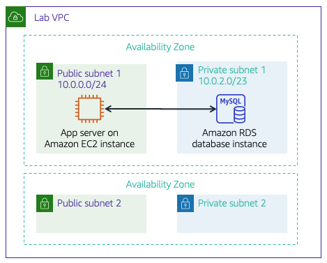

# Module 5 - Guided Lab: Creating an Amazon RDS Database

## Lab overview and objectives

Traditionally, creating a database can be a complex process that requires either a database administrator or a systems administrator. In the cloud, you can simplify this process by using Amazon Relational Database Service (Amazon RDS).

After completing this lab, you should be able to:
- Launch a database using Amazon RDS  
- Configure a web application to connect to the database instance

At the end of this lab, your architecture will look like the following example:



## Task 1: Creating an Amazon RDS database

In this task, you will create a MySQL database in your virtual private cloud (VPC). MySQL is a popular open source relational database management system (RDBMS), so there are no software licensing fees.

1. In the search box to the right of  Services, search for and choose RDS to open the RDS console.

2. Choose `Create database`

3. Under `Engine options`, select MySQL. The options include several use cases, ranging from enterprise-class databases to Dev/Test systems. In the options, you might notice Amazon Aurora. Aurora is a MySQL-compatible system that was re-architected for the cloud. If your company uses large-scale MySQL or PostgreSQL databases, Aurora can provide enhanced performance.

4. Set the templates and availability and durability options:

    ```
    Under the Templates section, select  Dev/Test.

    Under the Availability and durability section, select   Single DB instance 
    ```

    Note: the default Multi-AZ deployment option automatically creates a replica of the database in a second Availability Zone for High Availability, however in this lab that is not needed.

5. Under the `Settings` section, configure these options:

    ```
    DB instance identifier: inventory-db

    Username: admin

    Password: lab-password

    Confirm password: lab-password


    ```

6. Under the `DB instance class` section, configure these options:

    ```
    Select Burstable classes (includes t classes).

    Select db.t3.micro
    ```

7. Under the `Connectivity` section, configure these options: 

    ```
    Virtual Private Cloud (VPC): Lab VPC

    Existing VPC security groups: 

        - Choose DB-SG. It will be highlighted. 
        - Remove the default security group.
    ```

8. Expand the `Additional configuration` panel, then configure these settings:

    ```
    Initial database name: inventory

    Note: This is the logical name of the database that will be used by the application.

    Clear (turn off) the Enable Enhanced monitoring option
    ```

9. Choose `Create database` (at the bottom of the page).

You should receive a message indicating that your database is being created.

 `Warning:` If you receive an error message that mentions rds-monitoring-role, confirm that you have cleared (turned off) the Enhanced Monitoring option in the previous step, then try again.

Before you continue to the next task, the database instance status must be `Available`. This process might take several minutes.


## Task 2: Configuring web application communication with a database instance

This lab automatically deployed an Amazon Elastic Compute Cloud (Amazon EC2) instance with a running web application. You must use the IP address of the instance to connect to the application.

10. In the search box to the right of  Services, search for and choose EC2 to open the EC2 console.

11. In the left navigation pane, choose Instances. In the center pane, there should be a running instance that is named `App Server`.

12. Select the `App Server` instance.

13. In the Details tab, copy the Public IPv4 address to your clipboard.

14. Open a new web browser tab, paste the `IP address` into the address bar, and then press ENTER. The web application should appear. It does not display much information because the application is not yet connected to the database.

15. Choose `Settings`. You can now configure the application to use the RDS DB instance you created earlier. You will first retrieve the `Database Endpoint` so that the application knows how to connect to a database.

16. Return to the AWS Management Console, but do not close the application tab. You will return to it soon.

17. In the `Services` search box, search for and choose `RDS` to open the RDS console.

18. In the left navigation pane, choose `Databases`.

19. Choose `inventory-db`.

20. Scroll to the Connectivity & Security section and copy the Endpoint to your clipboard. It should look similar to this example: `inventory-db.crwxbgqad61a.rds.amazonaws.com`

21. Return to the browser tab with the Inventory application, and enter these values:

    ```
    Endpoint: Paste the endpoint you copied earlier
    Database: inventory
    Username: admin
    Password: lab-password
    Choose Save
    ```

    The application will now connect to the database, load some initial data, and display information.

22. Add inventory,  edit, and delete inventory information by using the web application. The inventory information is stored in the Amazon RDS MySQL database that you created earlier in the lab. This means that any failure in the application server will not lose any data. It also means that multiple application servers can access the same data.

22. Insert new records into the table. Ensure that the table has 5 or more inventory records before submitting your work. You have now successfully launched the application and connected it to the database!

`Optional:` You can access the saved parameters in the `Systems Manager` console, under `Parameter Store`.